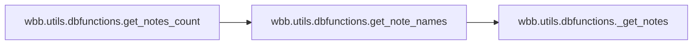
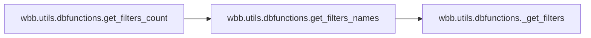
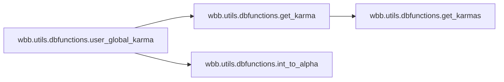
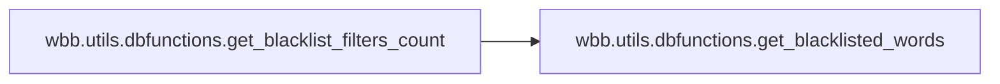

# Wbb Utils

[_Documentation generated by Documatic_](https://www.documatic.com)

<!---Documatic-section-Codebase Structure-start--->
## Codebase Structure

<!---Documatic-block-system_architecture-start--->
```mermaid
None
```
<!---Documatic-block-system_architecture-end--->

# #
<!---Documatic-section-Codebase Structure-end--->

<!---Documatic-section-wbb.utils.dbfunctions.get_notes_count-start--->
## [wbb.utils.dbfunctions.get_notes_count](3-wbb_utils.md#wbb.utils.dbfunctions.get_notes_count)

<!---Documatic-section-get_notes_count-start--->


### Object Calls

* wbb.utils.dbfunctions.get_note_names

<!---Documatic-block-wbb.utils.dbfunctions.get_notes_count-start--->
<details>
	<summary><code>wbb.utils.dbfunctions.get_notes_count</code> code snippet</summary>

```python
async def get_notes_count() -> dict:
    chats = notesdb.find({'chat_id': {'$exists': 1}})
    if not chats:
        return {}
    chats_count = 0
    notes_count = 0
    for chat in await chats.to_list(length=1000000000):
        notes_name = await get_note_names(chat['chat_id'])
        notes_count += len(notes_name)
        chats_count += 1
    return {'chats_count': chats_count, 'notes_count': notes_count}
```
</details>
<!---Documatic-block-wbb.utils.dbfunctions.get_notes_count-end--->
<!---Documatic-section-get_notes_count-end--->

# #
<!---Documatic-section-wbb.utils.dbfunctions.get_notes_count-end--->

<!---Documatic-section-wbb.utils.dbfunctions.get_filters_count-start--->
## [wbb.utils.dbfunctions.get_filters_count](3-wbb_utils.md#wbb.utils.dbfunctions.get_filters_count)

<!---Documatic-section-get_filters_count-start--->


### Object Calls

* wbb.utils.dbfunctions.get_filters_names

<!---Documatic-block-wbb.utils.dbfunctions.get_filters_count-start--->
<details>
	<summary><code>wbb.utils.dbfunctions.get_filters_count</code> code snippet</summary>

```python
async def get_filters_count() -> dict:
    chats = filtersdb.find({'chat_id': {'$lt': 0}})
    if not chats:
        return {}
    chats_count = 0
    filters_count = 0
    for chat in await chats.to_list(length=1000000000):
        filters_name = await get_filters_names(chat['chat_id'])
        filters_count += len(filters_name)
        chats_count += 1
    return {'chats_count': chats_count, 'filters_count': filters_count}
```
</details>
<!---Documatic-block-wbb.utils.dbfunctions.get_filters_count-end--->
<!---Documatic-section-get_filters_count-end--->

# #
<!---Documatic-section-wbb.utils.dbfunctions.get_filters_count-end--->

<!---Documatic-section-wbb.utils.dbfunctions.get_warns_count-start--->
## [wbb.utils.dbfunctions.get_warns_count](3-wbb_utils.md#wbb.utils.dbfunctions.get_warns_count)

<!---Documatic-section-get_warns_count-start--->
<!---Documatic-block-wbb.utils.dbfunctions.get_warns_count-start--->
<details>
	<summary><code>wbb.utils.dbfunctions.get_warns_count</code> code snippet</summary>

```python
async def get_warns_count() -> dict:
    chats = warnsdb.find({'chat_id': {'$lt': 0}})
    if not chats:
        return {}
    chats_count = 0
    warns_count = 0
    for chat in await chats.to_list(length=100000000):
        for user in chat['warns']:
            warns_count += chat['warns'][user]['warns']
        chats_count += 1
    return {'chats_count': chats_count, 'warns_count': warns_count}
```
</details>
<!---Documatic-block-wbb.utils.dbfunctions.get_warns_count-end--->
<!---Documatic-section-get_warns_count-end--->

# #
<!---Documatic-section-wbb.utils.dbfunctions.get_warns_count-end--->

<!---Documatic-section-wbb.utils.dbfunctions.get_karmas_count-start--->
## [wbb.utils.dbfunctions.get_karmas_count](3-wbb_utils.md#wbb.utils.dbfunctions.get_karmas_count)

<!---Documatic-section-get_karmas_count-start--->
<!---Documatic-block-wbb.utils.dbfunctions.get_karmas_count-start--->
<details>
	<summary><code>wbb.utils.dbfunctions.get_karmas_count</code> code snippet</summary>

```python
async def get_karmas_count() -> dict:
    chats = karmadb.find({'chat_id': {'$lt': 0}})
    if not chats:
        return {}
    chats_count = 0
    karmas_count = 0
    for chat in await chats.to_list(length=1000000):
        for i in chat['karma']:
            karma_ = chat['karma'][i]['karma']
            if karma_ > 0:
                karmas_count += karma_
        chats_count += 1
    return {'chats_count': chats_count, 'karmas_count': karmas_count}
```
</details>
<!---Documatic-block-wbb.utils.dbfunctions.get_karmas_count-end--->
<!---Documatic-section-get_karmas_count-end--->

# #
<!---Documatic-section-wbb.utils.dbfunctions.get_karmas_count-end--->

<!---Documatic-section-wbb.utils.dbfunctions.user_global_karma-start--->
## [wbb.utils.dbfunctions.user_global_karma](3-wbb_utils.md#wbb.utils.dbfunctions.user_global_karma)

<!---Documatic-section-user_global_karma-start--->


### Object Calls

* wbb.utils.dbfunctions.get_karma
* wbb.utils.dbfunctions.int_to_alpha

<!---Documatic-block-wbb.utils.dbfunctions.user_global_karma-start--->
<details>
	<summary><code>wbb.utils.dbfunctions.user_global_karma</code> code snippet</summary>

```python
async def user_global_karma(user_id) -> int:
    chats = karmadb.find({'chat_id': {'$lt': 0}})
    if not chats:
        return 0
    total_karma = 0
    for chat in await chats.to_list(length=1000000):
        karma = await get_karma(chat['chat_id'], await int_to_alpha(user_id))
        if karma and int(karma['karma']) > 0:
            total_karma += int(karma['karma'])
    return total_karma
```
</details>
<!---Documatic-block-wbb.utils.dbfunctions.user_global_karma-end--->
<!---Documatic-section-user_global_karma-end--->

# #
<!---Documatic-section-wbb.utils.dbfunctions.user_global_karma-end--->

<!---Documatic-section-wbb.utils.dbfunctions.get_served_chats-start--->
## [wbb.utils.dbfunctions.get_served_chats](3-wbb_utils.md#wbb.utils.dbfunctions.get_served_chats)

<!---Documatic-section-get_served_chats-start--->
<!---Documatic-block-wbb.utils.dbfunctions.get_served_chats-start--->
<details>
	<summary><code>wbb.utils.dbfunctions.get_served_chats</code> code snippet</summary>

```python
async def get_served_chats() -> list:
    chats = chatsdb.find({'chat_id': {'$lt': 0}})
    if not chats:
        return []
    chats_list = []
    for chat in await chats.to_list(length=1000000000):
        chats_list.append(chat)
    return chats_list
```
</details>
<!---Documatic-block-wbb.utils.dbfunctions.get_served_chats-end--->
<!---Documatic-section-get_served_chats-end--->

# #
<!---Documatic-section-wbb.utils.dbfunctions.get_served_chats-end--->

<!---Documatic-section-wbb.utils.dbfunctions.get_served_users-start--->
## [wbb.utils.dbfunctions.get_served_users](3-wbb_utils.md#wbb.utils.dbfunctions.get_served_users)

<!---Documatic-section-get_served_users-start--->
<!---Documatic-block-wbb.utils.dbfunctions.get_served_users-start--->
<details>
	<summary><code>wbb.utils.dbfunctions.get_served_users</code> code snippet</summary>

```python
async def get_served_users() -> list:
    users = usersdb.find({'user_id': {'$gt': 0}})
    if not users:
        return []
    users_list = []
    for user in await users.to_list(length=1000000000):
        users_list.append(user)
    return users_list
```
</details>
<!---Documatic-block-wbb.utils.dbfunctions.get_served_users-end--->
<!---Documatic-section-get_served_users-end--->

# #
<!---Documatic-section-wbb.utils.dbfunctions.get_served_users-end--->

<!---Documatic-section-wbb.utils.dbfunctions.get_gbans_count-start--->
## [wbb.utils.dbfunctions.get_gbans_count](3-wbb_utils.md#wbb.utils.dbfunctions.get_gbans_count)

<!---Documatic-section-get_gbans_count-start--->
<!---Documatic-block-wbb.utils.dbfunctions.get_gbans_count-start--->
<details>
	<summary><code>wbb.utils.dbfunctions.get_gbans_count</code> code snippet</summary>

```python
async def get_gbans_count() -> int:
    users = gbansdb.find({'user_id': {'$gt': 0}})
    users = await users.to_list(length=100000)
    return len(users)
```
</details>
<!---Documatic-block-wbb.utils.dbfunctions.get_gbans_count-end--->
<!---Documatic-section-get_gbans_count-end--->

# #
<!---Documatic-section-wbb.utils.dbfunctions.get_gbans_count-end--->

<!---Documatic-section-wbb.utils.dbfunctions.get_blacklist_filters_count-start--->
## [wbb.utils.dbfunctions.get_blacklist_filters_count](3-wbb_utils.md#wbb.utils.dbfunctions.get_blacklist_filters_count)

<!---Documatic-section-get_blacklist_filters_count-start--->


### Object Calls

* wbb.utils.dbfunctions.get_blacklisted_words

<!---Documatic-block-wbb.utils.dbfunctions.get_blacklist_filters_count-start--->
<details>
	<summary><code>wbb.utils.dbfunctions.get_blacklist_filters_count</code> code snippet</summary>

```python
async def get_blacklist_filters_count() -> dict:
    chats = blacklist_filtersdb.find({'chat_id': {'$lt': 0}})
    if not chats:
        return {'chats_count': 0, 'filters_count': 0}
    chats_count = 0
    filters_count = 0
    for chat in await chats.to_list(length=1000000000):
        filters = await get_blacklisted_words(chat['chat_id'])
        filters_count += len(filters)
        chats_count += 1
    return {'chats_count': chats_count, 'filters_count': filters_count}
```
</details>
<!---Documatic-block-wbb.utils.dbfunctions.get_blacklist_filters_count-end--->
<!---Documatic-section-get_blacklist_filters_count-end--->

# #
<!---Documatic-section-wbb.utils.dbfunctions.get_blacklist_filters_count-end--->

<!---Documatic-section-wbb.utils.dbfunctions.blacklisted_chats-start--->
## [wbb.utils.dbfunctions.blacklisted_chats](3-wbb_utils.md#wbb.utils.dbfunctions.blacklisted_chats)

<!---Documatic-section-blacklisted_chats-start--->
<!---Documatic-block-wbb.utils.dbfunctions.blacklisted_chats-start--->
<details>
	<summary><code>wbb.utils.dbfunctions.blacklisted_chats</code> code snippet</summary>

```python
async def blacklisted_chats() -> list:
    chats = blacklist_chatdb.find({'chat_id': {'$lt': 0}})
    return [chat['chat_id'] for chat in await chats.to_list(length=1000000000)]
```
</details>
<!---Documatic-block-wbb.utils.dbfunctions.blacklisted_chats-end--->
<!---Documatic-section-blacklisted_chats-end--->

# #
<!---Documatic-section-wbb.utils.dbfunctions.blacklisted_chats-end--->

<!---Documatic-section-wbb.utils.dbfunctions.get_rss_feeds-start--->
## [wbb.utils.dbfunctions.get_rss_feeds](3-wbb_utils.md#wbb.utils.dbfunctions.get_rss_feeds)

<!---Documatic-section-get_rss_feeds-start--->
<!---Documatic-block-wbb.utils.dbfunctions.get_rss_feeds-start--->
<details>
	<summary><code>wbb.utils.dbfunctions.get_rss_feeds</code> code snippet</summary>

```python
async def get_rss_feeds() -> list:
    feeds = rssdb.find({'chat_id': {'$exists': 1}})
    feeds = await feeds.to_list(length=10000000)
    if not feeds:
        return
    data = []
    for feed in feeds:
        data.append(dict(chat_id=feed['chat_id'], url=feed['url'], last_title=feed['last_title']))
    return data
```
</details>
<!---Documatic-block-wbb.utils.dbfunctions.get_rss_feeds-end--->
<!---Documatic-section-get_rss_feeds-end--->

# #
<!---Documatic-section-wbb.utils.dbfunctions.get_rss_feeds-end--->

<!---Documatic-section-wbb.utils.dbfunctions.get_rss_feeds_count-start--->
## [wbb.utils.dbfunctions.get_rss_feeds_count](3-wbb_utils.md#wbb.utils.dbfunctions.get_rss_feeds_count)

<!---Documatic-section-get_rss_feeds_count-start--->
<!---Documatic-block-wbb.utils.dbfunctions.get_rss_feeds_count-start--->
<details>
	<summary><code>wbb.utils.dbfunctions.get_rss_feeds_count</code> code snippet</summary>

```python
async def get_rss_feeds_count() -> int:
    feeds = rssdb.find({'chat_id': {'$exists': 1}})
    feeds = await feeds.to_list(length=10000000)
    return len(feeds)
```
</details>
<!---Documatic-block-wbb.utils.dbfunctions.get_rss_feeds_count-end--->
<!---Documatic-section-get_rss_feeds_count-end--->

# #
<!---Documatic-section-wbb.utils.dbfunctions.get_rss_feeds_count-end--->

[_Documentation generated by Documatic_](https://www.documatic.com)